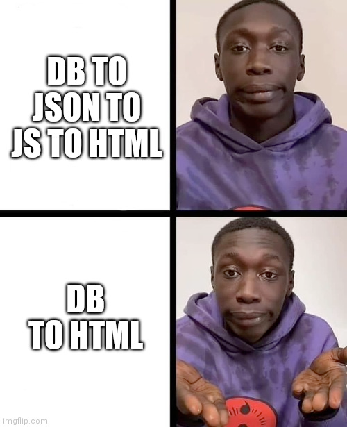

# Readme

Reference F# application with Falco, Htmx and Bulma

This project is an attempt to make CRUD applications easy for .net

The inspiration came from this meme:



Using the application, you should be able to create simple CRUD functionality for a given model as follows:

1. Create the model
2. Create the database migration for that model
3. Create a 'view' that displays a list of these models
4. Hook everything up
5. ...
6. Profit!


```fsharp
// Creating the model
// You can use System.ComponentModel.DataAnnotations to validate the model and the frontend will use them!
[<Table("Posts")>]
type Post() =
    inherit ActiveRecord()

    [<Column("Title")>]
    [<DisplayName("Title")>]
    [<TextFieldComponent>]
    [<Required>]
    member val Title : string = "" with get, set

    [<Column("Author")>]
    [<DisplayName("Author")>]
    [<TextFieldComponent>]
    [<EmailAddress>]
    [<Required>]
    member val Author : string = "" with get, set
    
    [<Column("Type")>]
    [<DisplayName("Type")>]
    [<StaticDropdownFieldComponent("Personal", "Technical")>]
    [<Required>]
    member val Type : string = "" with get, set

    [<Column("Body")>]
    [<DisplayName("Body")>]
    [<TextAreaFieldComponent>]
    [<Required>]
    member val Body : string = "" with get, set
```

```sqlite
-- Create the migration
CREATE TABLE Posts (
   Id INTEGER PRIMARY KEY AUTOINCREMENT,
   Title TEXT NOT NULL,
   Body TEXT NOT NULL,
   Author TEXT NOT NULL,
   Type TEXT NOT NULL
) STRICT;

```

```fsharp
// Create the multi post view
let multiPostView (posts: Post seq): XmlNode =
    let baseUrl = getTableName<Post>.ToLowerInvariant()
    _main [ _class_ Bulma.container ] [
        _section [ ] [
            _h1 [ _class_ Bulma.title ] [ _textEnc "My latest posts!" ]
        ]
        _br []
        _section [ ] [
            _div [ _class_ Bulma.container ] [
                for post in posts ->
                    _article [ _class_ Bulma.media ] [
                        _div [ _class_ Bulma.``media-content`` ] [
                            _div [ _class_ Bulma.content ] [
                                _p [] [
                                    _strong [] [ _textEnc post.Title ]
                                    _br []
                                    _textEnc post.Body
                                    _br []
                                    _small [] [
                                        _a [
                                           Hx.get $"/{baseUrl}/{post.Id}"
                                           Hx.pushUrlOn
                                           Hx.swapOuterHtml
                                           _hxTarget_ "main"
                                        ] [ _textEnc "Read more..." ]
                                    ]
                                ]
                            ]
                        ]
                    ]
            ]
        ]
    ]
```

```fsharp
let websiteEndpoints =
    mainMenuEndpoints @
    
    // hook up the 'Post' endpoints with all the other endpoints.
    // all the urls will be under /posts/**** where 'posts' comes from the tablename in the model (automatically lowercased)
    (getEndpointListForType<Post> multiPostView parentView) @
    
    healthCheckEndpoints
```

